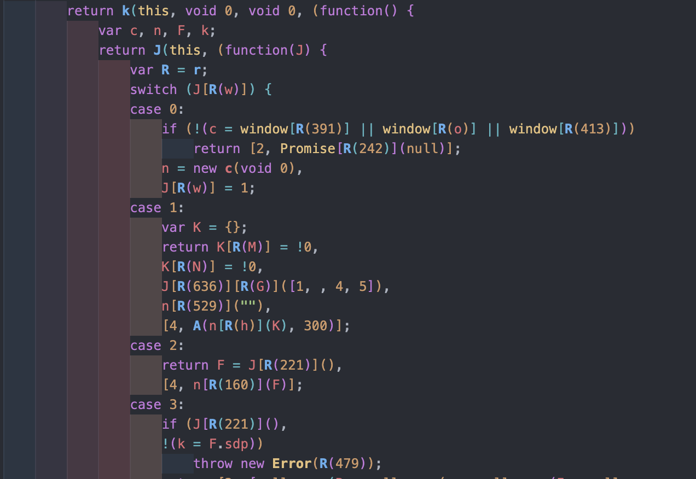
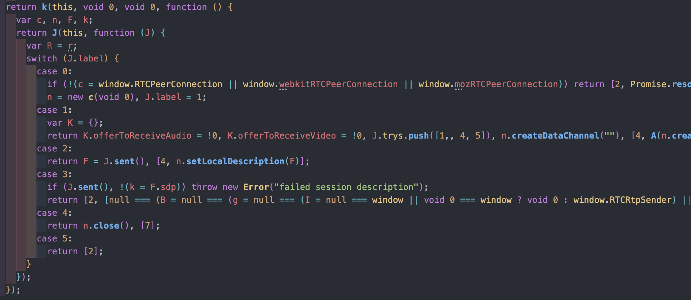
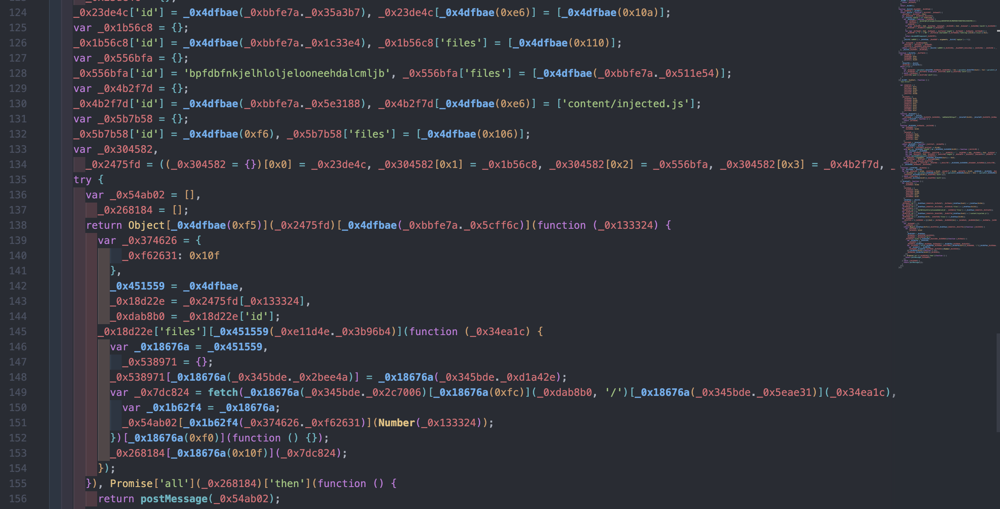
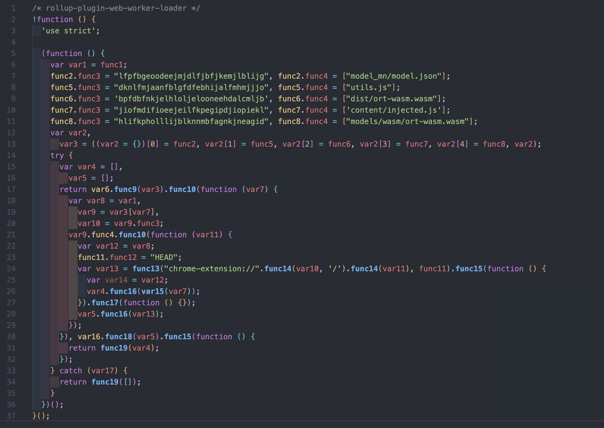

# hCaptcha hsv Deobfuscator

Welcome to the `hCaptcha hsv Deobfuscator` project! This is a Node.js project utilizing Babel AST to fully deobfuscate the hsv hCaptcha file. 

Remember, this is a deobfuscator, not a solver. This project is intended to help you understand how the hCaptcha script works, not to solve captchas for you, have fun studying the code and learning how it works.

This is a quick project I've done in couple of hours, so it's not perfect, have fun improving it.
Star the repo if you like it, it helps me a lot.


## Table of Contents
- [hCaptcha hsv Deobfuscator](#hcaptcha-hsv-deobfuscator)
  - [Table of Contents](#table-of-contents)
  - [How the hsv Script Works](#how-the-hsv-script-works)
  - [Obfuscation Method](#obfuscation-method)
    - [The list](#the-list)
    - [The shuffle](#the-shuffle)
    - [The decrypt function](#the-decrypt-function)
  - [Outputs](#outputs)
    - [hsv file](#hsv-file)
      - [Original](#original)
      - [Deobfuscated](#deobfuscated)
    - [Workers](#workers)
      - [Original](#original-1)
      - [Deobfuscated](#deobfuscated-1)
  - [How to Run](#how-to-run)
    - [Breakdown of Commands](#breakdown-of-commands)
  - [Contributing](#contributing)
  - [License](#license)
  - [My Links](#my-links)

## How the hsv Script Works
In brief, the hsv script performs calculations using WebAssembly (WASM) if supported by the browser, or native JavaScript otherwise. 

These calculations are vital for computing the solution based on the captcha's input and various other variables. 

Additionally, the script retrieves browser details and loads three different workers. 

These workers are embedded within the `hsv.js` file as base64 strings, each obfuscated differently from the hsv file itself and using hexadecimal strings.

## Obfuscation Method
The hCaptcha files uses an obfuscation technique referred to as `Encoded Closure Obfuscation`. 

This method combines closure scopes with encoded strings and array manipulations, creating a complex layer of obfuscation that conceals the underlying logic and functionality of the code. 

Is easier to clean instead of explaining :D

### The list
```js

function eI() {
    var A = ["Dg9W", "mZy5"];
    return (eI = function() {
        return A
    }
    )()
}
```

### The shuffle
```js

!function(A, I) {
    for (var g = 716, B = 704, Q = 496, C = r, E = A(); ; )
        try {
            if (514060 === -parseInt(C(g)) / 1 + parseInt(C(593)) / 2 + -parseInt(C(628)) / 3 + -parseInt(C(B)) / 4 + parseInt(C(607)) / 5 + parseInt(C(426)) / 6 * (parseInt(C(614)) / 7) + parseInt(C(Q)) / 8)
                break;
            E.push(E.shift())
        } catch (A) {
            E.push(E.shift())
        }
}(eI);
```

### The decrypt function
```js

    function r(A, I) {
        var g = eI();
        return r = function(I, B) {
            var Q = g[I -= 102];
            if (void 0 === r.KcMpYy) {
                r.cLeSYk = function(A) {
                    for (var I, g, B = "", Q = "", C = 0, E = 0; g = A.charAt(E++); ~g && (I = C % 4 ? 64 * I + g : g,
                    C++ % 4) ? B += String.fromCharCode(255 & I >> (-2 * C & 6)) : 0)
                        g = "abcdefghijklmnopqrstuvwxyzABCDEFGHIJKLMNOPQRSTUVWXYZ0123456789+/=".indexOf(g);
                    for (var D = 0, i = B.length; D < i; D++)
                        Q += "%" + ("00" + B.charCodeAt(D).toString(16)).slice(-2);
                    return decodeURIComponent(Q)
                }
                ,
                A = arguments,
                r.KcMpYy = !0
            }
            var C = I + g[0]
              , E = A[C];
            return E ? Q = E : (Q = r.cLeSYk(Q),
            A[C] = Q),
            Q
        }
        ,
        r(A, I)
    }
```

## Outputs
Here are the outputs of the deobfuscation process for the hsv file and one of the three workers.

### hsv file
#### Original

#### Deobfuscated


### Workers
The Workers files uses two layers of this obfuscation, while the hsv file uses just one.
#### Original

#### Deobfuscated



## How to Run
Before running the script, ensure all the necessary packages are installed by running the following command:
```bash
npm install
```

**Run Command:**
```bash
node main.js [inputFile.js] [outputFile.txt] [--extract-wasm][--wasm-file=mywasmfile.wasm] [--clean-workers] [--rename-workers] [--save-workers]
```
- Default input file is `hsv.js`
- Default output file is `hsv.out.js`

### Breakdown of Commands
- `--extract-wasm`: Extracts the base64 string containing the WASM script into a separate file to prevent IDE overloading.
  - `--wasm-file`: Optional, specifies the name for the WASM file. Default is `wasm.txt`.
- `--clean-workers`: Saves the three workers into separate files, deobfuscated, with their respective variable names.
  - `--rename-workers`: Renames all functions and variables (e.g., `var1`, `var2`, `func1`, `func2`) for readability, replacing the original hexadecimal names.
  - `--save-workers`: Saves the original (obfuscated) workers scripts.

## Contributing
Contributions are welcome! For significant changes, please open an issue first to discuss what you would like to change.

## License
This project is licensed under the MIT License. See the [LICENSE](LICENSE) file for more details.

## My Links
- [Website](https://glizzykingdreko.github.io)
- [GitHub](https://github.com/glizzykingdreko)
- [Twitter](https://mobile.twitter.com/glizzykingdreko)
- [Medium](https://medium.com/@glizzykingdreko)
- [Email](mailto:glizzykingdreko@protonmail.com)